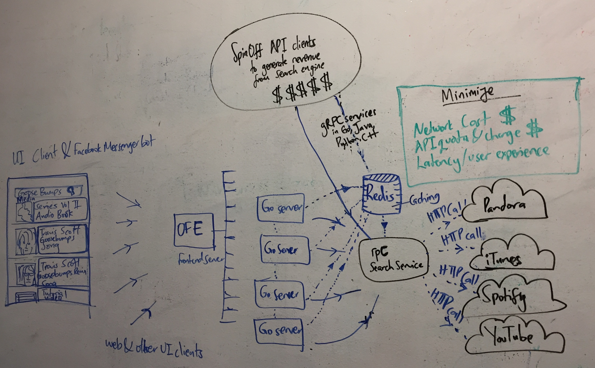
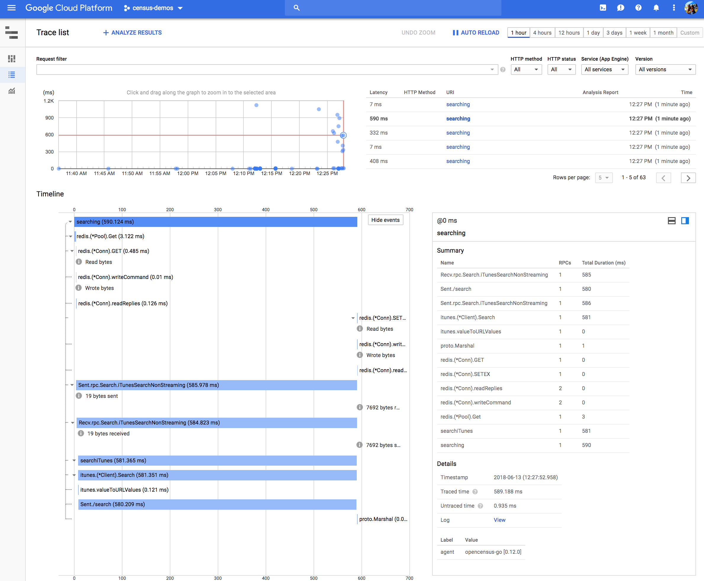
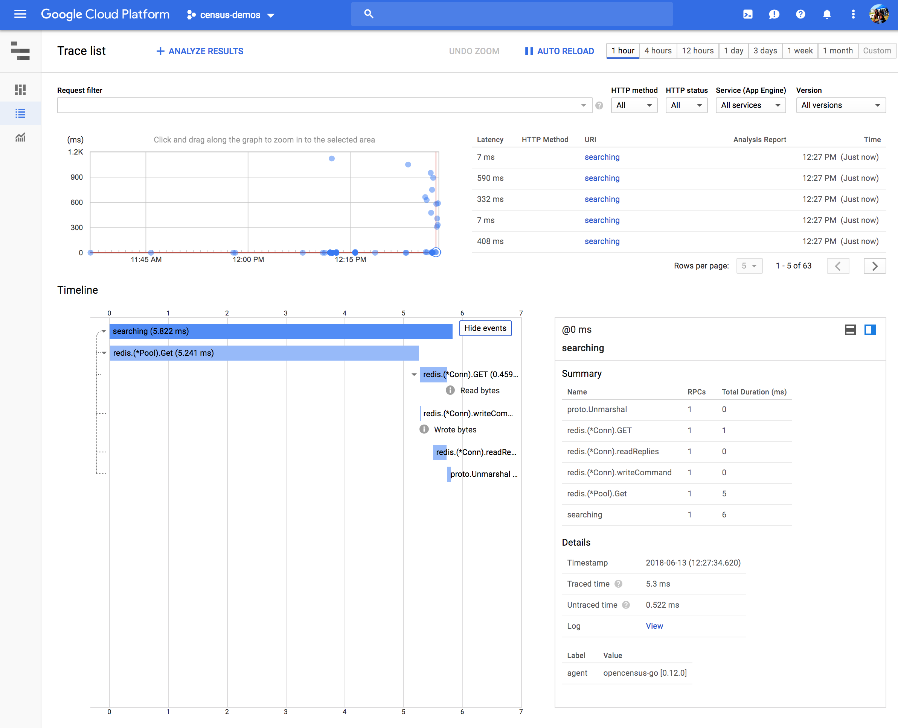

# itunes-search
Polyglot search backend cached by Redis and instrumented by OpenCensus end-to-end



## Prerequisites
* Go1.8+
* Java 7+
* Maven aka `mvn`
* Stackdriver Tracing and Monitoring accounts and GCP credentials
* Redis server

In  your environment, please set `GOOGLE_APPLICATION_CREDENTIALS` to point to
the file containing the Google Cloud Platform credentials for the project in
which you enabled Stackdriver Tracing and Monitoring.

## Environment variables

Key|Type|Default|Notes
---|---|---|---
ITUNESSEARCH_CLIENT_PROJECTID|String|"census-demos"|The Google Cloud Platform projectID for the project that has Stackdriver Tracing and Monitoring enabled
ITUNESSEARCH_REDIS_SERVER_HOST|String|"localhost"|The address of the Redis server
ITUNESSEARCH_GO_CLIENT_PROMETHEUS_BIND_ADDR|String:9887|The address of the Go client that prometheus will scrape. Also modify the Prometheus.yml file if you change the default
ITUNESSEARCH_JAVA_CLIENT_PROMETHEUS_BIND_ADDR|String|:9888|The address of the Go client that prometheus will scrape. Also modify the Prometheus.yml file if you change the default
ITUNESSEARCH_GO_SERVER_PROMETHEUS_BIND_ADDR|String|:9889|The address of the Go client that prometheus will scrape. Also modify the Prometheus.yml file if you change the default

## Server
```shell
go run server.go
```

## Clients

### Go Client
```shell
go run client.go
```

### Java Client
```shell
mvn install && mvn exec:java -Dexec.mainClass=io.mediasearch.search.MediasearchClient
```

## Output
* Tracing

### On cache miss


### On cache hit

